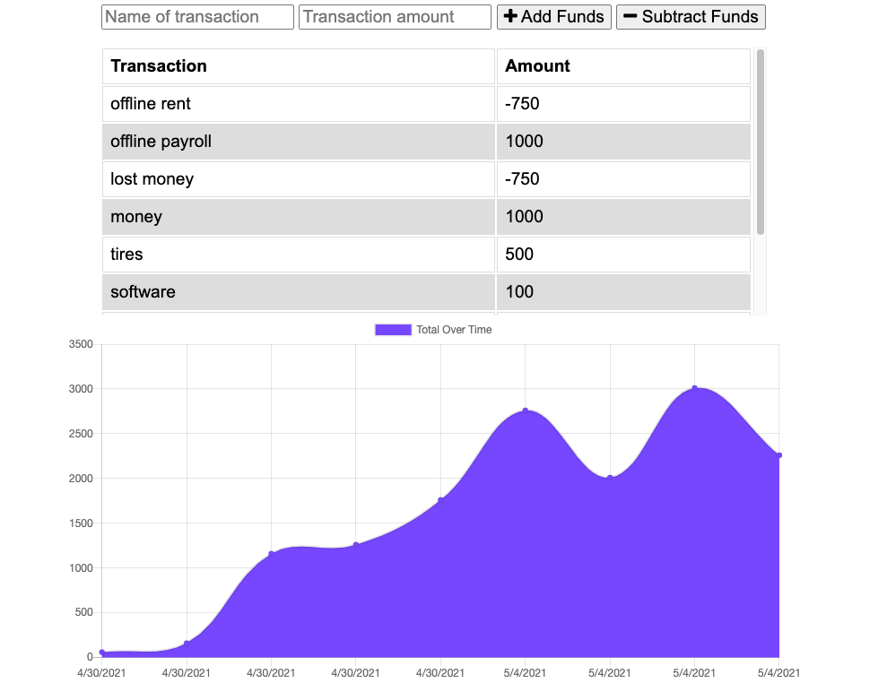
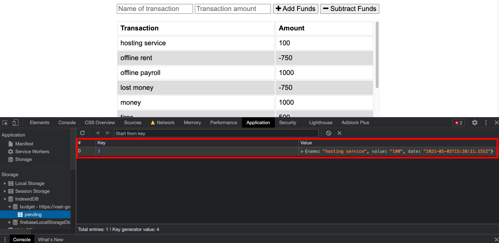

# Budget Trak

## Table of Contents

[DESCRIPTION](#description)

[LICENSE](#license)

[USAGE](#usage)

[CONTRIBUTE](#contribute)

[TEST](#test)

[QUESTIONS](#Questions)

## DESCRIPTION

This application is a simple budget tracker that has PWA capabilities and will also save data. Even if the application is not connected to a network (offline). When the application is connected to the network again the data will move into our MongoDB to be saved for later use.

## USAGE

To use this Repo you will need to install all packages in the package.jsom

## LICENSE

This application is using the MIT license

## Test

I have added a console.log for where data is sent over to the database. You can open the appliation in your web browser. After doing so right the screen and click inspect and then to go the Application tab. Press Offline under Service Worker to bring the application offline. Input data into the graph after inputing data into the graph, refresh your indexDB to see if the data saved. If it did bring the application back online and go to node console to see if the data is being sent to your database.

## Contribute

If you would like to contribute please follow the [contributors convenent](https://www.contributor-covenant.org/version/2/0/code_of_conduct/code_of_conduct.txt)

## Questions

If you have questions or spot an issue please contact me through github or email below:

Github: [Chinedu613](https://github.com/Chinedu613)

Email: cchukwuani@gmail.com
    